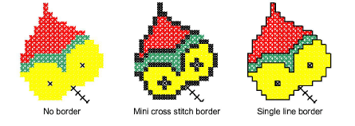

# Add borders to selected areas

Add a cross stitch border or a single line border, or both, to selected areas of a design.

## To add borders to selected areas...

1. Select either the Single Line or Full Cross icon.

2. Click the Flood Fill icon and click inside an area. A line of outline stitches is added around the edges of the selection.

Tip: Click again in the selection to add another line of stitches inside the first line.

Tip: To combine a cross stitch with a line border, select Full Cross stitch type and Flood Fill, then select Single Line and Flood Fill again.
