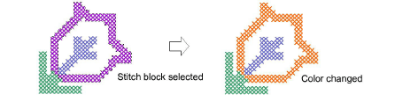
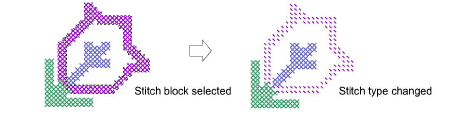

# Change stitch block settings

|  | Use Edit > Auto Select to change the color and/or stitch type of selected stitch blocks. |
| -------------------------------------------------- | ---------------------------------------------------------------------------------------- |

You can change the color and/or stitch type of selected stitch blocks at any time.

## To change stitch block settings...

1. Use Auto Select to select the stitch block/s.

Tip: Hold down Ctrl to select multiple blocks.

2. Change color and/or stitch type as required:

- Select a new color from the palette. The color fills the selected area/s. The area remains selected.

- Select a new stitch type from the Stitch toolbar. The stitch type fills the selected area/s.

3. Press Esc to deselect the selected area/s.

## Related topics

- [Select cross stitches with Auto Select](Select_cross_stitches_with_Auto_Select)
