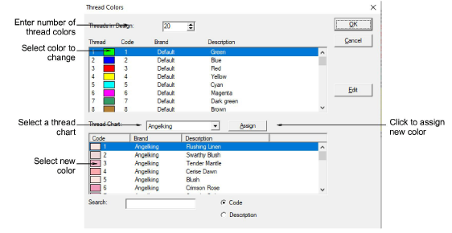

# Change thread colors

ES Cross Stitch lets you reassign design colors using the design’s thread chart. You can choose colors from pre-defined thread charts or mix your own.

## To change thread colors...

1Select Edit > Colorways. The Thread Colors dialog opens.

2Enter the total number of colors you want to use in the Threads in Design field.

Tip: Color palettes are limited to 128 colors. 36 will fit comfortably at 800 x 600 resolution.

3Select a thread chart from the Thread Chart list.

4In the upper panel, select the thread color to change.

Tip: To mix your own color, use the Edit button.

5In the lower panel, select the new thread color and click Assign.

Tip: To find a required color, search using the Search field.

## Related topics

- [Edit thread colors](Edit_thread_colors)
- [Search for threads](Search_for_threads)
