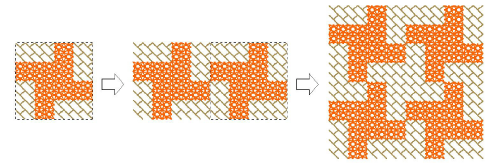

# Copy, cut & paste stitch blocks

|    | Use General > Copy to copy selected stitch blocks to the clipboard.   |
| ------------------------------ | --------------------------------------------------------------------- |
|      | Use General > Cut to cut selected stitch blocks to the clipboard.     |
|  | Use General > Paste to paste copied stitch blocks from the clipboard. |

In ES Cross Stitch you work with stitch blocks or areas rather than design objects. You can copy, cut and paste selected stitch blocks at any time. [See also Rubber stamp fills.](Rubber_stamp_fills)

## To copy, cut and paste stitch blocks...

1Select the stitch block to copy or cut. [See Selecting & locking stitches for details.](Selecting_locking_stitches)

2Click the Copy or Cut icon. The selected area or areas are copied to the clipboard.

3Click the Paste icon. The duplicate area is pasted over top of the selected area.

4Click and drag to move the pasted stitch block.

Tip: Duplicate and rotate blocks of stitches to make patterns.

## Related topics

- [Transforming stitch blocks](Transforming_stitch_blocks)
