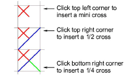
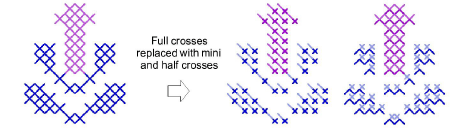

# Create combination stitches

|  | Use Cross Stitch > Pencil to add combination stitches. |
| -------------------------------- | ------------------------------------------------------ |

Fractional cross stitches – ¼, ½, or ¾ – can be combined to make crosses comprised of multiple colors. You can also combine mini crosses, elongated vertical or horizontal crosses and outline stitches.

## To create combination stitches...

1Select a stitch type.

|  | Select 3/4 for three quarter crosses.                     |
| ------------------------------------------------------ | --------------------------------------------------------- |
|                  | Select 1/2 for half crosses.                              |
|            | Select 1/4 for quarter crosses.                           |
|                  | Select Mini Cross for mini crosses.                       |
|          | Select Elongated Vertical Cross for vertical crosses.     |
|      | Select Elongated Horizontal Cross for horizontal crosses. |

2Select a color from the color palette.

3Click the Pencil icon.

4Click where you want the stitch to be inserted.

Note: If you do not have Insert selected, the whole stitch will be replaced.

5Repeat as many times as needed.

## Related topics

- [Set stitch color & type](../cross-stitch_digitizing/Set_stitch_color_type)
