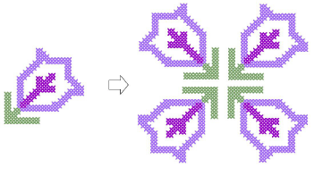

# Cross Stitch Editing

ES Cross Stitch provides techniques for editing cross stitch designs, including moving, rotating, and mirroring stitch blocks. You can erase stitches as well as change colors and stitch types of selected areas. You can clone a selection for re-use as a ‘rubber stamp’ and fill large areas with motifs or special composite stitches. You can also edit stitches to create combinations of partial crosses comprised of multiple colors.

This section provides details of cross stitch editing features including selecting and locking stitches as well as simple stitch editing. It also covers transforming stitch blocks. It also deals with special editing techniques as well as adjusting thread colors.

## Related topics

- [Selecting & locking stitches](Selecting_locking_stitches)
- [Simple stitch editing](Simple_stitch_editing)
- [Transforming stitch blocks](Transforming_stitch_blocks)
- [Special editing techniques](Special_editing_techniques)
- [Adjusting thread colors](Adjusting_thread_colors)
