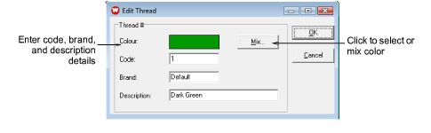
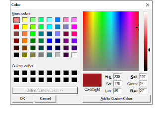

# Edit thread colors

You can edit the existing colors in a design without selecting a new color from a thread chart.

## To edit a thread color...

1. Select Edit > Colorways. The Thread Colors dialog opens.

2. In the upper panel, select the thread color to edit.

3. Click Edit. The Edit Thread dialog opens.

4. Enter code, brand, and description details for the thread color. Code is the identification number of a thread color in a brand.

5. Click Mix. The Color dialog opens.

6. From the Basic colors table, select a color that closely matches the color you require.

7. Click and drag the cross hairs on the color spectrum to get the exact color.

8. Drag the slider on the right of the color spectrum to adjust color brightness. The HLS and RGB values appear in the bottom right-hand corner of the Color dialog. Enter these values directly to define exact colors.

9. When you have mixed the required color, click Add to Custom Colors.

10. Click OK. The new color appears in the Color preview box.

11. Click OK. The new color appears in the Threads list.
