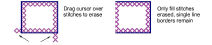
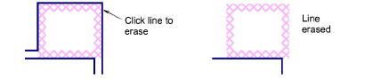

# Erase fills & single lines

|  | Use Cross Stitch > Eraser to erase fills and single lines. |
| -------------------------------- | ---------------------------------------------------------- |

Use the Eraser tool to remove stitches. The eraser will remove either fill stitches or single line borders depending on the stitch type selected. Cross-stitched borders are treated as fill stitches.

## To erase fills and single lines...

1. Click the Eraser icon.

2. Click Full Cross on the Stitch toolbar.

3. Click and drag the cursor across the stitches you want to remove.

Only fill stitches are removed. Single line borders remain.

::: tip
You can also erase cross stitches by selecting them and pressing the Delete key.
:::

4. Click Single Line on the Stitch toolbar.

5. Click anywhere on a single line. The line is removed. Cross stitches remain.

::: info Note
A single line border is removed in one click.
:::
