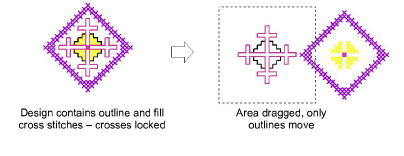

# Lock cross stitches

You can lock cross stitches and/or outlines so that they are not moved or edited by accident.

## To lock cross stitches...

1. Select Edit > Crosses or Edit > Outlines. When Crosses is ticked in the menu, cross stitches can be moved. Likewise, when Outlines is ticked, outlines can be moved.

2. Select an area and click and drag to move stitches.

3. Select Crosses or Outlines again to uncheck it and lock all crosses or outlines.
