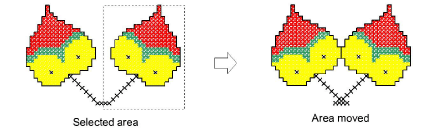

# Move cross stitch blocks

You can move blocks of cross stitches at any time.

## To move blocks of cross stitches...

1Select the stitch block to move.

2Click and drag it to a new location.

## Related topics

- [Selecting & locking stitches](Selecting_locking_stitches)
