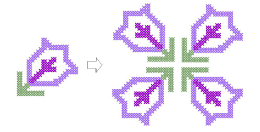

# Rotate cross stitch blocks

|  | Use Edit > Rotate Selection to rotate selected stitches. Click to rotate clockwise. Right-click to rotate counter-clockwise. |
| -------------------------------------------------- | ---------------------------------------------------------------------------------------------------------------------------- |

You can rotate blocks of cross stitches in a clockwise or counter-clockwise direction. Duplicate and rotate blocks of stitches to make patterns.

## To rotate blocks of cross stitches...

1Select the stitch block to rotate.

2Click the Rotate Selection icon.

## Related topics

- [Selecting & locking stitches](Selecting_locking_stitches)
