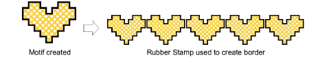

# Rubber stamp fills

|  | Use Cross Stitch > Rubber Stamp to clone a selection for re-use as a ‘rubber stamp’. |
| ------------------------------------------ | ------------------------------------------------------------------------------------ |

Clone a selection for re-use as a ‘rubber stamp’ and fill large areas with motifs or special composite stitches.

## To rubber stamp fills...

1. Click the Select icon and select the area to be cloned.

2. Click the Rubber Stamp icon. The selected area is copied and attached to the pointer.

3. Click to place the stamp as many times as you want.

4. Press Esc or select another icon to turn off Rubber Stamp.
