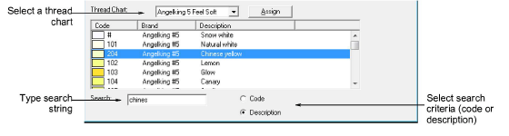

# Search for threads

You can search for threads by code or description in the Thread Colors dialog.

## To search for a thread...

1Select Edit > Colorways. The Thread Colors dialog opens.

2Select a thread chart from the Thread Chart list.

3Select either Code or Description to search on.

Note: Code is the identification number of a thread color in a brand.

4In the Search field, key in the first few characters of the required code or description. As you type, the cursor will highlight the closest match in the thread chart.

5Scroll through the list to find the exact shade you want. Check your threads and select the color according to whatever shade most closely matches the color in the chart.
