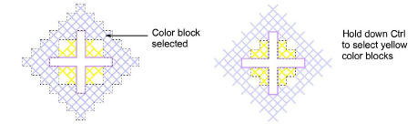

# Select cross stitches with Auto Select

|  | Use Cross Stitch > Auto Select to select a single color block or an undigitized area. |
| ---------------------------------------- | ------------------------------------------------------------------------------------- |

Auto Select is specific to ES Cross Stitch. It allows you to select a single color block or a closed undigitized area. Only adjoining stitches of the same color are selected.

## To select cross stitches with Auto Select...

1. Click the Auto Select icon.

2. Click a block of stitches. Only adjoining stitches of that color are selected.

Tip: Hold down Ctrl to select multiple blocks.

Tip: You can change the color of the selection completely, by selecting a color from the palette.
