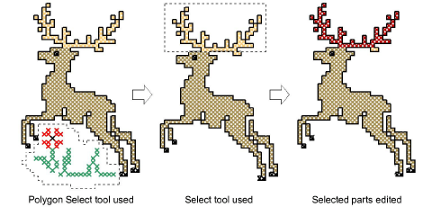

# Select cross stitches with Select tools

|    | Use Pointer > Select to select a single stitch or block of stitches. |
| ---------------------------------------------- | -------------------------------------------------------------------- |
|  | Use Pointer > Polygon Select to select irregular areas or shapes.    |

The Select and Polygon Select tools work in a similar way to EmbroideryStudio. The difference is that in ES Cross Stitch you work with stitch blocks or areas rather than design objects.

## To select cross stitches with Select tools...

- With the Select tool selected, simply drag a bounding box around the area to be selected.
- With the Polygon Select tool selected, mark reference points around the area you want to select and press Enter.

::: tip
Hold down Ctrl to select multiple areas.
:::
