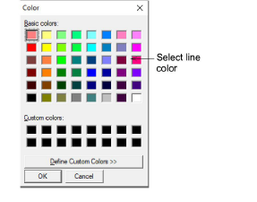

# Adjust grid settings

|  | Click General > Grid to show or hide the grid. Select Special > Options to change grid settings. |
| ---------------------------- | ------------------------------------------------------------------------------------------------ |

Set up your design grid for easy visualization of cross stitch placement.

## To adjust grid settings...

1Select Special > Options and click the Grid tab.

2Activate grid lines with the Show Grid checkbox.

3Select Show Major Lines and set the number of crosses to fit between them.

Tip: If you've set a fabric count of, say, 14 stitches per inch, set the distance between major grid lines to 14 as well. That way you can visualize better each square inch of your design.

4Click Edit to change the color of the major and minor lines.

5Select from the available colors or define your own. Click Define Custom Colors to mix your own colors from the color wheel.

6Click OK.
