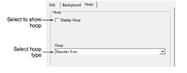

# Change hoop settings

You can show or hide selected hoops in ES Cross Stitch for use as backdrops to help in laying out designs.

## To change hoop settings...

1Right-click the Hoop icon. The Options > Hoop tab opens.

2Select the Display Hoop checkbox.

3Select a hoop type from the list.

4Click OK.

Tip: If you resize a design to fit inside the hoop, stitches may be stacked on top of each other and pull the fabric. You can avoid this problem by reducing the number of crossovers to single (2 threads) for both fills and outlines. You can also use a thinner weight thread. [See also Set stitch density.](../cross-stitch_digitizing/Set_stitch_density)
