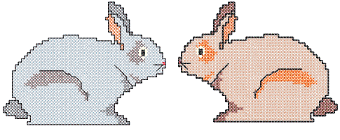

# Cross Stitch Essentials

Cross stitch design involves a different digitizing technique to ordinary embroidery design. For this reason, ES Cross Stitch is a separate application to the main EmbroideryStudio application. It also has a different work environment with different settings for design size and density. Like the main application you will do most of your work with digitizing backdrops. Design viewing is also different to EmbroideryStudio.

This section describes the use of the ES Cross Stitch Design Window, as well as techniques for setting up your work environment and design size and density. It also covers working with backdrops and viewing cross stitch designs. It also discusses handling of cross stitch design files.

## Related topics

- [Opening ES Cross Stitch](Opening_ES_Cross_Stitch)
- [Setting up work environment](Setting_up_work_environment)
- [Working with backdrops](Working_with_backdrops)
- [Viewing cross stitch designs](Viewing_cross_stitch_designs)
- [Handling cross stitch design files](Handling_cross_stitch_design_files)
