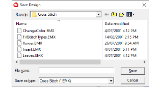

# Generate stitches

|  | Select Stitch > Generate to generate stitches from crosses. |
| ------------------------------------ | ----------------------------------------------------------- |

What appears on-screen when you digitize is actually a ‘painting’ of the design. You are not digitizing so much as coloring the boxes with crosses. Thus you need to ‘generate’ your design in order to translate the crosses on screen into actual stitches. [See also View stitches as crosses or tiles.](View_stitches_as_crosses_or_tiles)

## To generate stitches...

- Click the Generate icon. Stitches are generated and the design saved as an EMX file. If this is the first time you have saved the design, you will be prompted to name the file.

::: info Note
You can only save as EMX.
:::

## Related topics

- [Save cross stitch designs](Save_cross_stitch_designs)
- [Use cross stitch with EmbroideryStudio](Use_cross_stitch_with_EmbroideryStudio)
