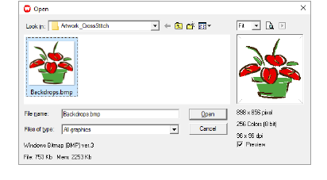

# Insert bitmap images

You can insert bitmap images of various formats for use as digitizing backdrops.

## To insert bitmap images...

1. Select Insert > Drawing File. The Open dialog opens.

2. Select a folder from the Look In list.

3. Select a file type from the Files of Type list (e.g. BMP).

4. Select the file you want to insert.

Tip: Select the Preview checkbox to preview the selected file.

5. Click Open.

Tip: You can also use Edit > Paste Drawing > As Vector/As Bitmap if the drawing is on the clipboard.
