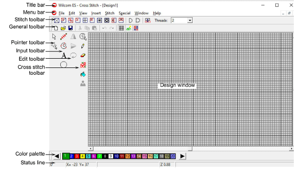

# Opening ES Cross Stitch

Cross stitch design involves a different digitizing technique to ordinary embroidery design. For this reason, ES Cross Stitch has its own Design Window which you open from within EmbroideryStudio.

## To open ES Cross Stitch...

- Run EmbroideryStudio.
- Select File > Cross Stitch. The ES Cross Stitch Design Window opens.

- Cross stitch toolbars include the Standard and Stitch toolbars across the top of the Design Window.
- Pointer, Input, Edit and Cross Stitch toolbars are located at the left of the Design Window.
- Click and drag toolbars into the Design Window as necessary.
- Double-click the title area of a toolbar to return it to its original position.
