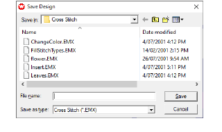

# Save cross stitch designs

|  | Click General > Save to save cross stitch files. |
| ---------------------------- | ------------------------------------------------ |

Save your design early and often. Use the EMX extension for saving cross stitch files.

## To save cross stitch designs...

1. Select File > Save. If this is the first time you have saved the design, the Save As dialog opens. The file is saved as an EMX file.

2. Type a new name for the design and click Save.

## Related topics

- [Generate stitches](Generate_stitches)
- [Use cross stitch with EmbroideryStudio](Use_cross_stitch_with_EmbroideryStudio)
