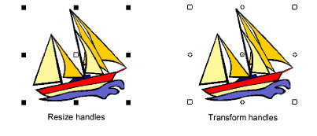
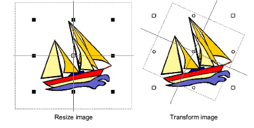

# Scale & transform bitmap images

You can scale and reshape images once they are loaded into ES Cross Stitch. This is useful for sizing artwork precisely to the grid.

::: tip
If an image needs to be significantly resized or rotated, it’s best to do so during scanning or in a graphics application.
:::

## To scale and transform bitmap images...

1. Insert the image in the normal way. [See Insert bitmap images for details.](Insert_bitmap_images)

2. Click the Select icon.

3. Holding down the Alt key, click the image. Eight resize handles appear around the image. Click and drag these to size the image as you would any other object.

4. Still holding down the Alt key, click the image again. Eight transform handles appear around the image. Use these to rotate the image. An additional center point lets you move the whole design.

