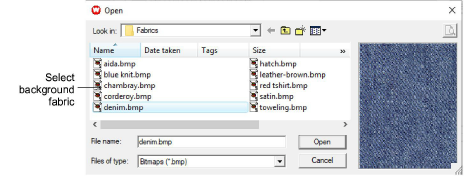

# Set background colors & fabrics

In ES Cross Stitch you can change the background color of the Design Window to match the color of your fabric. Or you can select a background fabric for more realistic previews and presentations.

## To set background color or fabric...

1. Select Special > Options.

2. Select the Background tab.

3. Select the Design Window background type.

- Color: uses the selected color.
- Fabric: uses an image of a fabric.

4. Select a color or fabric to use.

- To select a background color, click Edit. Select a color from the Color dialog and click OK.

- To select a fabric, click Browse. Select a fabric type from the Open dialog and click OK.

You can center or tile the fabric bitmap in the Design Window. If the bitmap is large enough to fill the entire window, select Center. Otherwise, select Tile.

5. Click OK.
