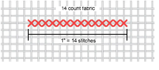
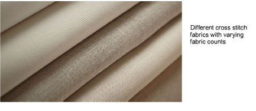
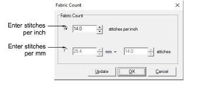
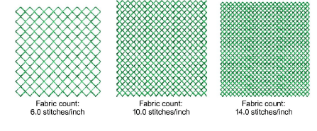
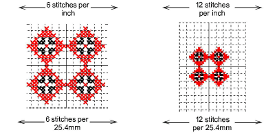

# Set design size

You set cross stitch design size by adjusting the ‘fabric count’, generally defined as ‘holes per inch’. This actually changes the scale of your finished design. The more stitches per inch, the smaller and more compact the resulting design.

Cross stitch fabric used in handcraft is woven with the same number of threads in each direction to create evenly-sized squares. There are two main types – aida and linen. Aida is the most popular. It is made from 100% cotton and comes in various fabric counts.

Known commercially as ‘evenweave’, these fabrics are suited to traditional cross stitch because they produce evenly-sized thread blocks in both directions. Stitches appear as squares or parts of squares. The higher the fabric count, the tighter the weave, and therefore the smaller the cross stitches produced. Fabric count in machine embroidery still determines design size – the more stitches per inch, the smaller and more compact the design. However, fabric count in the software does not necessarily correspond to fabric warp and weft when stitched on the machine.

## To set the design size...

1Select Special > Fabric Count. The Fabric Count dialog opens.

2Select a fabric count option, inches or millimeters:

| Option            | Purpose                                                                                                                                                                                               |
| ----------------- | ----------------------------------------------------------------------------------------------------------------------------------------------------------------------------------------------------- |
| Stitches per inch | The fewer stitches per inch, the bigger the resulting design.                                                                                                                                         |
| Stitches per mm   | Because a cross stitch is bigger than a millimeter, you can adjust the mm and stitch settings in relation to each other. The higher the mm value, or smaller the stitch value, the bigger the design. |

Tip: By clicking Update, you get an immediate conversion of any values you have entered. For example, change the stitches per inch value, click Update, and the corresponding stitches per mm value will be updated.

3Click OK.

Tip: If you create a design where every square has a stitch, remember to baste and stabilize the fabric.
