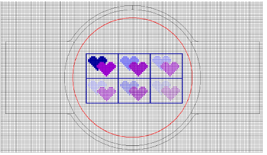

# Setting up work environment

In ES Cross Stitch, design size is determined by ‘fabric count’. The more stitches per inch, for example, the smaller and more compact the design. In addition, you need to set up your design grid for easy visualization and cross stitch placement. You can also visualize your design within a target hoop. Similarly, you can select a background color or fabric for more realistic previews and presentations.

## Related topics

- [Set design size](Set_design_size)
- [Adjust grid settings](Adjust_grid_settings)
- [Change hoop settings](Change_hoop_settings)
- [Set background colors & fabrics](Set_background_colors_fabrics)
