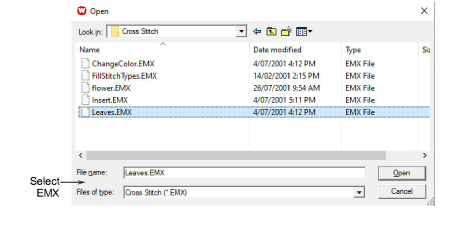

# Use cross stitch with EmbroideryStudio

To include cross stitch in your EMB designs, you need to save and close any cross stitch designs as EMX then open them in EmbroideryStudio.

::: tip
You cannot view your cross stitch design in TrueView in the cross stitch program. However you can do so by saving the design and opening it in EmbroideryStudio.
:::

## To use cross stitch with EmbroideryStudio...

1. Save your design as EMX.

2. Open EmbroideryStudio.

3. Select File > Open. The Open dialog opens.

4. Select EMX files from the Files of Type list.

5. Select your file and click Open. The cross stitch file opens in EmbroideryStudio and can be further embellished with regular embroidery. Note that the EMX file is treated as manual stitch blocks. For this reason, scaling is not advisable.

## Related topics

- [Generate stitches](Generate_stitches)
- [Save cross stitch designs](Save_cross_stitch_designs)
