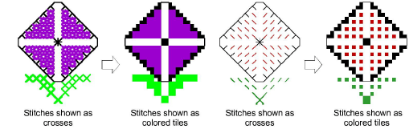

# View stitches as crosses or tiles

|  | Click General > Crosses to show stitches as colored tiles or cross stitches. |
| ------------------------------------------ | ---------------------------------------------------------------------------- |

There are two display modes for ES Cross Stitch – crosses or colored tiles. When you change to tile mode, you see the design in colored blocks without stitch details as appear in stitch mode. [See also Generate stitches.](Generate_stitches)

## To view stitches as crosses or tiles...

1Click the Crosses icon. Any digitized areas are shown as crosses (or lines for line borders).

2Click again to show stitches as colored tiles.

