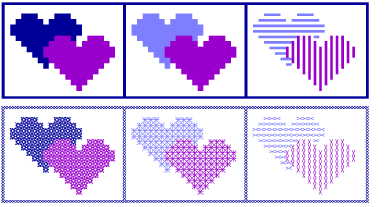

# Viewing cross stitch designs

While you are working in ES Cross Stitch, you will toggle between different viewing modes to better visualize and understand your design. You will also routinely consult the Status Bar for important information about the design.

## Related topics

- [View stitches as crosses or tiles](View_stitches_as_crosses_or_tiles)
- [View design information](View_design_information)
