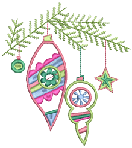

# Decorative Embroidery

EmbroideryStudio provides many features for the creation of motif runs and fills, textured and patterned fills, open stitching, and curved fills.

## Patterned stitching

This section explains how to create textures with tatami offsets and program splits. Create your own and add them to a custom library. Creating stitch patterns with carving stamps is covered as well as adding details with user-defined splits. [See Patterned Stitching for details.](../patterns/Patterned_Stitching)

## Curved stitching

This section covers contoured fills and flexi-splits. It also covers the creation of radial fill effects and curved fills. [See Curved Stitching for details.](../curves/Curved_Stitching)

## Motif stitching

This section describes how to insert motifs into your design, and how to rotate, mirror and scale them. It explains how to manage motifs, including how to create your own motifs and motif sets. It also describes how to create both motif runs and motif fills, as well as how to apply 3D effects to motif fills. [See Motif Stitching for details.](../motifs/Motif_Stitching)

## Specialty stitching

This section describes how to create jagged or fluffy edges as well as open stitching with trapunto effect. It also describes how to create stippling and cross stitching, as well as accordion spacing, and color blending effects. Creating curved fills with ‘Florentine’ and ‘liquid’ effects is also covered. [See Specialty Stitching for details.](../specialty/Specialty_Stitching)
