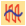
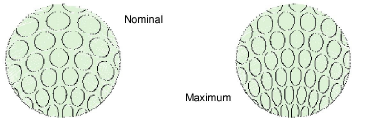
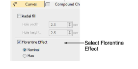

# Adjust curved fill settings

|  | Right-click Stitch Effects > Florentine Effect to adjust settings. |
| -------------------------------------------------------------- | ------------------------------------------------------------------ |
|          | Right-click Stitch Effects > Liquid Effect to adjust settings.     |

In a curved fill, [stitch lengths](../../glossary/glossary) vary to map the needle point pattern to the curve. You choose between Nominal and Maximum stitch length calculation.

## To adjust curved fill settings...

- Right-click a Florentine Effect or Liquid Effect icon to access object properties.

- Select a preferred stitch length calculation:

| Option  | Function                                                                                                                                                                                                   |
| ------- | ---------------------------------------------------------------------------------------------------------------------------------------------------------------------------------------------------------- |
| Nominal | Average length of fill stitches matches the current Stitch Length setting. This generates roughly the same number of fill stitches as with normal stitching.                                               |
| Max     | Longest stitch matches the Stitch Length setting. This generally produces smoother curves than Nominal, but the stitch count is higher. Use Max when the curve is tight with respect to the stitch length. |
