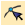
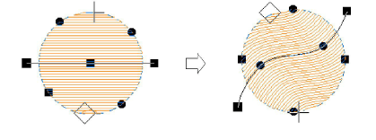

# Apply curved fills to existing objects

|  | Use Stitch Effects > Florentine Effect to apply curve stitching to existing objects. |
| -------------------------------------------------------------- | ------------------------------------------------------------------------------------ |
|          | Use Stitch Effects > Liquid Effect to apply curve stitching to existing objects.     |
|        | Use Reshape > Reshape Object to adjust control points of the guideline.              |

Apply Florentine Effect to existing [complex fill](../../glossary/glossary#complex-fill) objects. The effect can also be applied to [Column A/B](../../glossary/glossary) objects. You can also apply Liquid Effect to existing objects.

## To apply a curved fill to an existing object...

1. Select an object and select a curve fill method.

2. With the object still selected, click the Reshape Object icon. A default guideline with three corner control points appears.

3. Reshape guidelines in the normal way by moving, adding, changing or deleting reference points.

4. Press Enter. EmbroideryStudio regenerates stitches along the new curve.

5. Turn on TrueView™ or click the Show Needle Points icon to view the results.

## Related topics...

- [Reshaping embroidery objects](../../Modifying/reshape/Reshaping_embroidery_objects)
