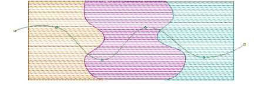
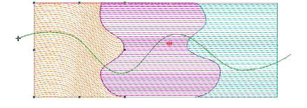
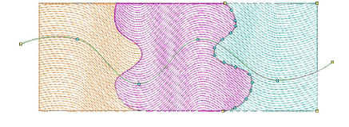

# Apply curved lines to multiple objects

|                                      | Use Outline > Digitize Run to place a row of single or triple run stitches along a digitized line. |
| -------------------------------------------------------------- | -------------------------------------------------------------------------------------------------- |
|  | Use Stitch Effects > Florentine Effect to apply curve stitching to existing objects.               |
|          | Use Stitch Effects > Liquid Effect to apply curve stitching to existing objects.                   |

You can apply Florentine Effect or Liquid Effect to multiple objects in a design. All objects share the same curved line.

## To apply a curved line to multiple objects...

1. Using the Digitize Run tool, digitize a guideline for the curve to follow. Digitize a second line if you want to apply Liquid Effect.

2. With the guideline selected, select Object > Use for Florentine Effect. This tags the digitized run as the default curve line.

::: tip
With two guidelines selected, the Object > Use for Liquid Effect command becomes available.
:::

3. Select an object and click the Florentine Effect icon. Notice that the turning stitches follow the guideline.

4. Apply to the other objects in the same way. Notice that the turning stitches again follow the original guideline.

5. Press Esc to complete. Optionally, delete the original run object if not required as part of the design.

::: tip
Turn on TrueView™ or use the Show Needle Points tool to view the results.
:::

## Related topics...

- [Digitizing outlines & details](../../Digitizing/input/Digitizing_outlines_details)
