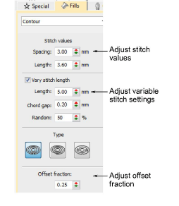
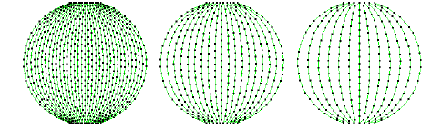
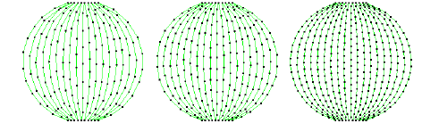
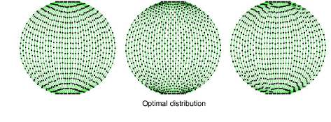
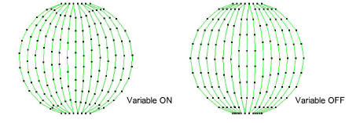

# Contour stitch settings

|  | Use Stitch Types > Outlines > Contour to create outlines which follow object contours, creating a curved, light-and-shade effect. Right-click for settings. |
| ---------------------------------------------------------- | ----------------------------------------------------------------------------------------------------------------------------------------------------------- |
|        | Use Stitch Types > Fills > Contour to create fills which follow object contours, creating a curved, light-and-shade effect. Right-click for settings.       |

Adjust [stitch length](../../glossary/glossary#stitch-length), spacing and offset fraction for Contour fills.

## To adjust contour stitch settings...

- Right-click the Contour icon to access object properties.

- The Spacing setting has the most conspicuous effect on contour fills. Use it to adjust between dense and more open fills. The spacing value sets the widest part of the shape. As the shape narrows, spacing decreases.

- While it has no conspicuous effect on fill appearance, the Length setting helps to distribute stitches evenly throughout the shape.

- The Offset Fraction controls the pattern of needle penetrations to achieve even distribution of stitches and prevent needle penetrations from forming unwanted lines. Try different settings to find the optimal distribution of needle points.

- Activate Vary Stitch Length as preferred. Stitch length is automatically adjusted on corners for more even curves. Settings are the same as simple run stitching.

## Related topics...

- [Digitizing methods](../../Digitizing/input/Digitizing_methods)
- [Simple run stitching](../../Digitizing/stitches/Simple_run_stitching)
- [Tatami density](../../Digitizing/stitches/Tatami_density)
- [Stitch length settings](../../Digitizing/stitches/Stitch_length_settings)
