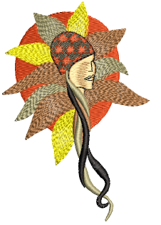

# Contoured fills

Contour is a curved fill stitch type which can be applied to Column A/B or Circle/Ring objects. It can also be used for outline stitching. Stitches follow the contours of a shape, creating a contoured, light and shade effect. Use it to create a sense of movement in contrast to flatter fills created by tatami stitching.

## Related topics...

- [Digitize contour fills](Digitize_contour_fills)
- [Contour stitch settings](Contour_stitch_settings)
