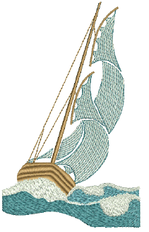
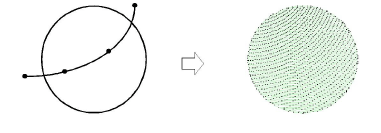
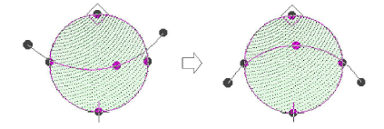
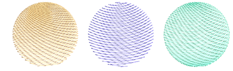

# Create curved fills with Florentine Effect

|                      | Use Traditional Digitizing > Complex Fill to digitize filled shapes with a single stitch angle. Right-click for settings. |
| -------------------------------------------------------------- | ------------------------------------------------------------------------------------------------------------------------- |
|                    | Use Graphics Digitizing > Digitize Closed Shape to digitize closed shapes. Press &lt;Ctrl&gt; to create a square.         |
|  | Use Stitch Effects > Florentine Effect to create custom curved stitching.                                                 |
|        | Use Reshape > Reshape Object to adjust control points of the guideline.                                                   |

While you can apply Florentine Effect to any closed shape, it is generally used in conjunction with Complex Fill or Close Shape input methods. This is because Florentine Effect overrides any stitch angles already applying. You can apply the effect while digitizing or to existing objects.

## To create a curved fill with Florentine Effect...

- Choose an input method and a suitable stitch type. Florentine Effect works well with satin, tatami, or even program splits.
- Click the Florentine Effect icon.
- Digitize boundaries and entry and [exit points](../../glossary/glossary) of the object following the prompts.
- Digitize the guideline you want stitches to follow and press Enter. The guideline must intersect both sides of the object, have at least three points, and must not overlap itself. Curves generally give better results than sharp corners.

- Use the Reshape Object tool to modify the guideline.

## Tips for use...

- For best results, use smaller [stitch lengths](../../glossary/glossary) – e.g. 4.00 mm or less.
- With satin stitch, turn off auto-splits.
- Curved fill effects work better with open stitching.
- They can also work well with Accordion Spacing.

## Related topics...

- [Digitizing Shapes](../../Digitizing/input/Digitizing_Shapes)
- [Stitch Types](../../Digitizing/stitches/Stitch_Types)
- [Contoured fills](Contoured_fills)
- [Accordion spacing](../specialty/Accordion_spacing)
- [Apply curved fills to existing objects](Apply_curved_fills_to_existing_objects)
- [Reshaping embroidery objects](../../Modifying/reshape/Reshaping_embroidery_objects)
