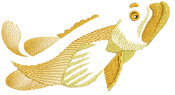
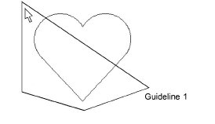
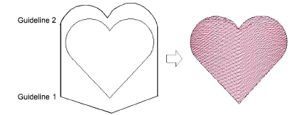
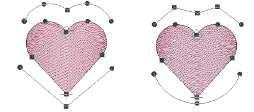

# Create curved fills with Liquid Effect

|      | Use Traditional Digitizing > Complex Fill to digitize filled shapes with a single stitch angle. Right-click for settings. |
| -------------------------------------------------------- | ------------------------------------------------------------------------------------------------------------------------- |
|    | Use Graphics Digitizing > Digitize Closed Shape to digitize closed shapes. Press &lt;Ctrl&gt; to create a square.         |
|              | Use Stitch Effects > Liquid Effect to create curved stitch effects with two guidelines.                                   |
|  | Use Reshape > Reshape Object to adjust control points of the guideline.                                                   |

Liquid Effect works the same ways Florentine Effect except that you enter twin guidelines. Turning stitches are distributed evenly between guidelines to produce smooth curves. Liquid Effect guidelines are digitized outside the object, rather than over. While you can apply the effect to any closed shape, it overrides any existing stitch angles.

## To create a curved fill with Liquid Effect...

1. Choose a suitable input method and stitch type, and click Liquid Effect.

2. Digitize outline, entry and [exit points](../../glossary/glossary) following the prompts. You are not prompted to digitize a stitch angle.

3. Digitize the first guideline around the outside of the object. You must enter at least three reference points.

4. Press Enter. You are prompted to enter a second guideline. Elastic lines appear joining the two guidelines.

5. Digitize the second in the same direction as the first, marking at least three reference points.

Note: The two guidelines must not overlap or intersect the object outline.

6. Press Enter to apply.

Tip: Use the Reshape Object tool to modify guidelines.

## Related topics...

- [Digitizing Shapes](../../Digitizing/input/Digitizing_Shapes)
- [Stitch Types](../../Digitizing/stitches/Stitch_Types)
- [Reshaping embroidery objects](../../Modifying/reshape/Reshaping_embroidery_objects)
