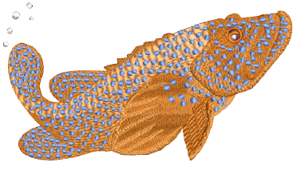

# Curved Stitching

EmbroideryStudio provides a variety of stitch types and techniques for creating curved stitching effects. These follow the contours of a shape and can be used to give a sense of depth and movement to your stitching. Some can be used with borders as well as fills.

Curved stitch effects covered in this section include:

| Feature                                              | Overview            |                                                                                                                    |
| ---------------------------------------------------- | ------------------- | ------------------------------------------------------------------------------------------------------------------ |
|            | Contour             | Stitches follow the contours of a shape, creating a contoured, light and shade effect.                             |
|                      | Offset              | Similar to Contour in following the contours of a shape. It can be used in combination with turning stitches.      |
|              | Spiral Fill         | Works best with simple shapes without holes or islands. Use it with either fixed or variable length run stitching. |
|              | Radial Fill         | Generates radial turning stitching with various stitch types including satin, tatami and program splits.           |
|              | Flexi Split         | Decorative effect where one or more lines of a program split pattern are molded to the object shape.               |
|  | Florentine / Liquid | Create interesting curved effects by shaping needle penetrations to follow the contour of digitized lines.         |

## Related topics...

- [Contoured fills](Contoured_fills)
- [Offset fills](Offset_fills)
- [Spiral fills](Spiral_fills)
- [Radial fills](Radial_fills)
- [Flexi-splits](Flexi-splits)
- [Curved fills](Curved_fills)
