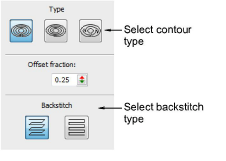
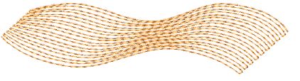
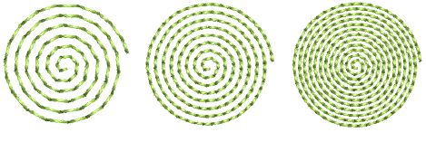
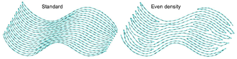
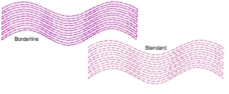
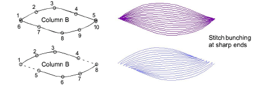

# Digitize contour fills

|      | Use Outline Stitch Types > Contour to create outlines which follow object contours, creating a curved, light-and-shade effect. Right-click for settings.       |
| ---------------------------------------------------- | -------------------------------------------------------------------------------------------------------------------------------------------------------------- |
|  | Use Fill Stitch Types > Contour to create fills which follow object contours, creating a curved, light-and-shade effect. Right-click for settings.             |
|                      | Use Traditional Digitizing > Column A to create columns of varying width and stitch angle. Right-click for settings.                                           |
|                      | Use Traditional Digitizing > Column B to create asymmetrical columns of turning stitches, where opposite sides are different shapes. Right-click for settings. |
|                    | Use Graphics Digitizing > Ellipse to digitize ellipse or circle embroidery objects.                                                                            |

The Object Properties > Fills > Contour tab offers the following contour stitch options. There are three types of contour stitching which can be applied to most closed objects – Standard, Spiral and Even Density.

## Standard contour

|  | Standard | Lays rows of stitches back and forth along a shape, perpendicular to the digitized stitch angle. |
| -------------------------------------------------- | -------- | ------------------------------------------------------------------------------------------------ |

The number of stitch lines is constant, so stitching is denser where the shape narrows, and more open where the shape widens.

## Spiral contour

|  | Spiral | Creates a single, continuous line of stitching that spirals around to fill the shape. |
| ---------------------------------------------- | ------ | ------------------------------------------------------------------------------------- |

Spiral is typically used for rings and borders, it is also suitable for other closed shapes.

Spiral Contour can only be used with closed shapes with two outlines such as rings. If a shape is not properly closed, it will be filled with Standard Contour instead.

::: tip
To fill a solid shape with Spiral Contour, create a closed object with a very small hole at the center. For example, to create a circle filled with Spiral Contour, digitize a thick ring with a very small inner boundary.
:::

## Even density contour

|  | Even Density | Maintains even density across shapes which vary in width. |
| -------------------------------------------------------- | ------------ | --------------------------------------------------------- |

Even Density is ideally suited to shapes of variable width. Contour stitching follows the shape with uniform stitch density.

::: warning Caution
EmbroideryStudio may not generate even-density contour stitching in certain shapes. Stitching will revert to standard contour stitching.
:::

## Backstitch

The Backstitch panel offers a choice of two backstitch styles – Standard and Borderline.

The term ‘backstitch’ refers to every second row of stitches in the fill. The choice depends on style – dense or less dense.

| Backstitch                                                   | Function   |                                                                                                                                    |
| ------------------------------------------------------------ | ---------- | ---------------------------------------------------------------------------------------------------------------------------------- |
|      | Standard   | Creates backstitch rows that are slightly shorter than the forward rows, reducing small stitches. Suitable for high density fills. |
|  | Borderline | Creates parallel backstitch rows to give a smooth, well-defined edge. Suitable for lower density fills.                            |

If spacing is small, Borderline backstitch will not be applied. This prevents damage to the fabric from too many small stitches.

::: tip
When you digitize shapes with pointed ends – e.g. leaves, diamonds, stars – cut the ends to prevent the stitches from bunching.
:::

