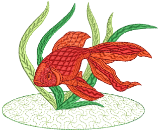
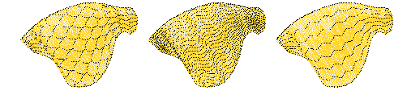
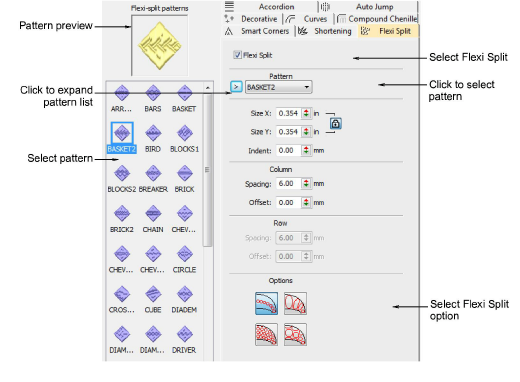
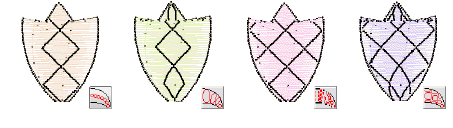
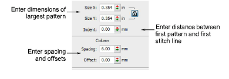
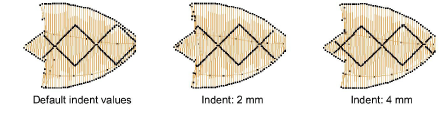
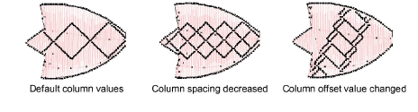
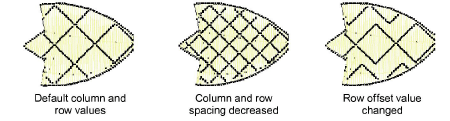

# Flexi-splits

|  | Use Stitch Effects > Flexi Split to create decorative split patterns following stitch angles and scaled according to object width. Right-click for settings. |
| -------------------------------------------------- | ------------------------------------------------------------------------------------------------------------------------------------------------------------ |

Flexi Split is a decorative effect where one or more lines of a program split pattern are used in the object fill. It is both a patterned and curved fill. The pattern follows the [stitch angle](../../glossary/glossary#stitch-angle) and may be scaled to fit the width of the object. It is intended for use with objects with turning stitches or varying column width. You can apply Flexi Split to a wide variety of object and stitch types. Use existing patterns or create your own.

## To apply the Flexi Split...

- Select an object and click the Flexi Split icon.

- Right-click to access properties.

- Select a pattern from the droplist. Alternatively, click the arrow button to access the pattern library.
- Select one of four options.

- Adjust Flexi Split settings to vary size, shape indent, spacing and pattern offsets.

- In the Size X and Size Y fields, enter dimensions of the largest pattern in the effect. The scaling lock maintains aspect ratio.
- In the Indent field, enter the distance between the first pattern and the first stitch line.

- In the Column panel, enter spacing and offset settings as required:

- If you selected an option that uses more than one row of patterns, the fields in the Row panel are available.

## Related topics...

- [Make split patterns](../patterns/Make_split_patterns)
