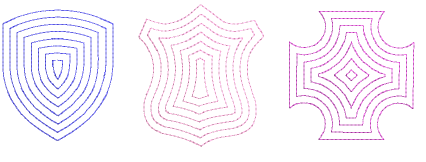
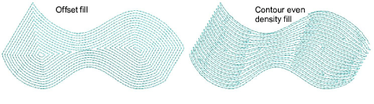
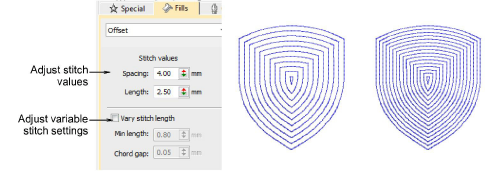

# Offset fills

|  | Use Fill Stitch Types > Offset Fill to create offset fill stitching in any closed shape. |
| ------------------------------------------ | ---------------------------------------------------------------------------------------- |

Offset Fill is similar to Contour in that it produces a curved fill stitch type which follows the contours of the shape. However, it can be applied to complex fill objects as well as turning stitch objects. It is fully editable in that it dynamically recalculates offsets as you reshape. Like Contour, it is best used for open fills with low stitch counts. Stitch angles have no effect on the fill pattern.

When applied to shapes of varying width, Offset fill is similar to Contour > Even Density in producing an even distribution of needle penetrations, avoiding stitch bunching in narrower sections.

Offset fill settings are similar to Contour fill. The Spacing setting has the most conspicuous effect for creating less or more open fills.

## Related topics...

- [Digitizing methods](../../Digitizing/input/Digitizing_methods)
- [Maze fills](../specialty/Maze_fills)
- [Simple run stitching](../../Digitizing/stitches/Simple_run_stitching)
- [Tatami density](../../Digitizing/stitches/Tatami_density)
- [Stitch length settings](../../Digitizing/stitches/Stitch_length_settings)
