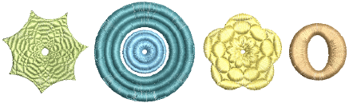
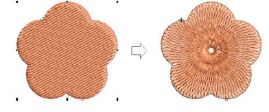
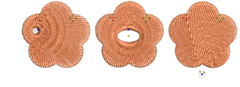
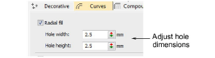
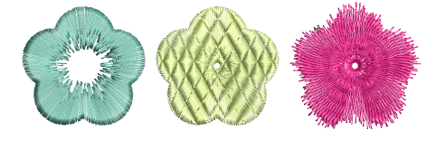
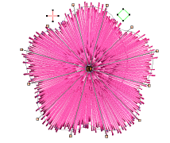

# Radial fills

|  | Use Stitch Effects > Radial Fill to create radial turning stitching with various stitch types including satin, tatami and program splits. Can be applied to ring shapes. |
| -------------------------------------------------- | ------------------------------------------------------------------------------------------------------------------------------------------------------------------------ |
|      | Click Reshape > Reshape Object to view the reshape nodes of a selected object.                                                                                           |

Radial Fill creates radial turning stitching in either Satin, Tatami or Program Split objects. Stitches are generated from the outside edge to the geometric center. The center can be shifted. The effect may be on or off while digitizing. Operations such as Mirror Merge or Remove Overlaps preserve the effect.

## To create a radial fill...

- Select a closed-object and click the Radial Fill icon.

- To modify, select and click Reshape Object. In Reshape mode, you can:
- Move the center point of the radial stitching.
- Set the size of the center hole.
- Edit the hole shape for circle/ellipse.

- Alternatively, hole properties can be changed via Object Properties.

::: tip
Like Spiral Fill stitch, the center of Radial Fill effect can be moved outside the shape or into an included hole to achieve a different effect, without losing the original shape.
:::

- Optionally, apply Satin, Program Split and/or Jagged Edge together with Radial Fill.

- Press Enter to apply, Esc to finish.

::: info Note
You are not able to directly edit stitch angles generated by Radial Fill. But you can apply Break Apart and edit the resulting turning angle closed object. [See also Break apart composite objects.](../../Modifying/reshape/Break_apart_composite_objects)
:::

## Tips for use...

Not all patterns and stitch settings or objects (size specific) are suitable for Radial Fill. In particular, if you are using it with larger objects, use one or a combination of the following to avoid bunching at the center:

- Increase the size of the hole, move the center into an existing hole in the object, or move it outside the object altogether.
- Add Jagged Edge to the inside.
- Use larger stitch spacing – increase by about 20%.
- Avoid patterns which add needle penetrations close to the center of the object.
- Use Edge Run underlay with smaller objects, to help reduce the number of stitches at the object center.
- Radial Fill can be applied to ring shapes. The center of the radial effect will lie within the hole of the ring. Use Reshape to adjust as necessary.
