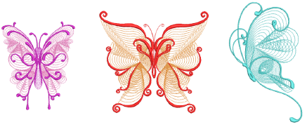
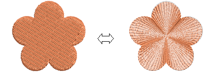
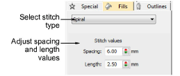
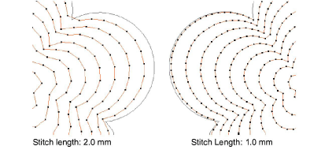
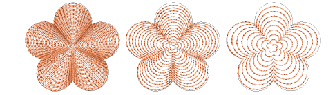
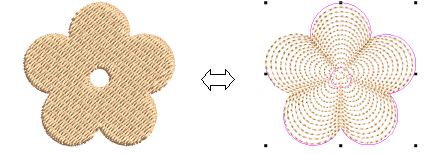
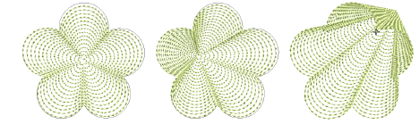

# Spiral fills

|  | Use Fill Stitch Types > Spiral Fill to create spiral stitching from the center of any closed object. |
| -------------------------------------------------- | ---------------------------------------------------------------------------------------------------- |

Use Spiral Fill to create open stitching that follows the contours of a shape. It is useful when trying to emphasize movement in your digitizing. It works best with simple shapes that can be stitched in a single segment without holes or islands. Use it with either fixed or variable length run stitching. With longer shapes, it may generate stitches that go outside the perimeter of the object, but this can provide for some interesting visual effects. Different stitch types can be used – sculpture, backstitch, stemstitch, or run stitch. Similarly, basic spiral fills can be converted to outlines such as motif run, satin outline, sequin run, and bling run.

## To create a spiral fill...

- Create or select a closed shape and click Spiral Fill.

- To change settings, double-click or right-click the object to access object properties.

Note: Stitch angle has no effect on the pattern layout.

- Adjust spiral Stitch settings as desired:
- Adjust Stitch length for smoother or sharper curves.

- Adjust Stitch spacing for denser or more open stitching.

Note: If the object already has a hole, this is ignored when spiral is applied. It returns when other stitch types are applied.

Tip: The center of the spiral can be reshaped or moved with the Reshape Object tool. Some interesting visual effects can be achieved. You can even move it outside the object outline.

## Related topics...

- [Digitizing methods](../../Digitizing/input/Digitizing_methods)
