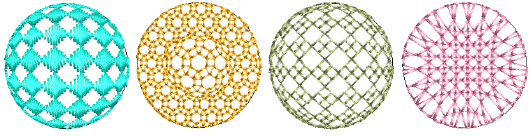
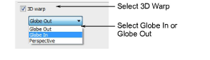
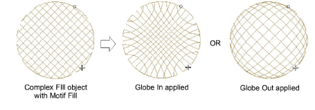
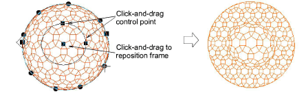
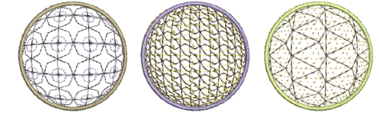

# Create convex & concave effects

|                          | Click Stitch Effects > 3D Warp to apply 3D effects to selected motif fills. Right-click to change settings. |
| -------------------------------------------------------- | ----------------------------------------------------------------------------------------------------------- |
|  | Use Reshape > Reshape Object to reshape selected 3D Warp objects.                                           |

Using Globe In with 3D Warp gives a concave effect by increasing motif size and spacing around a center point. Globe Out gives a convex effect by decreasing motif size and spacing. You can apply the effect to an entire object, or to a specified part of the fill.

## To create convex and concave effects...

- Select a motif fill object and right-click the 3D Warp icon. The Object Properties > Curve docker opens.

- Select the 3D Warp checkbox, and select Globe In or Globe Out from the list.
- Press Enter or click Apply. The Globe In or Out effect is applied to the selected object.

- To make further adjustments, click Reshape Object with the object selected. A guide frame appears with three control points.

- Adjust the control points to:
- Change frame height
- Change frame width
- Reposition frame.

Tip: You can generate layers of colored motifs by duplicating an object and selecting a different color. For example, after filling a shape with circles, you can create a second layer, offset it, and apply a different color. You can then apply effects such as Globe Out to the whole motif fill.

