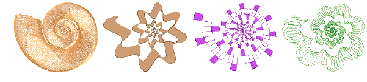
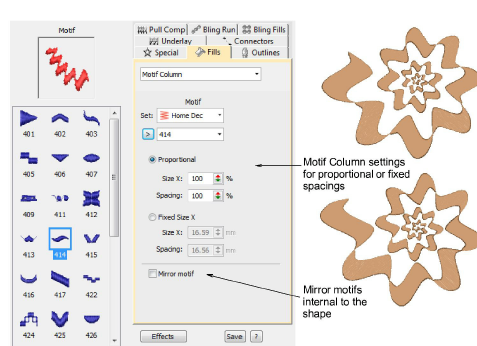
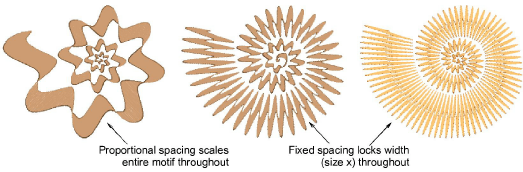

# Create graded motif columns

|  | Use Fill Stitch Types > Motif Column to place motifs along the center line of a column shape and resize to fit the shape. Right-clicking for settings. |
| -------------------------------------------- | ------------------------------------------------------------------------------------------------------------------------------------------------------ |

The Motif Column feature allows you to create graded columns of motif stitching. Motifs dynamically resize to fit varying widths. Similar in concept to flexi-split with turning satin, you digitize a tapering shape using, for example, Column A. Apply Motif Column and select a motif. Motifs are automatically ‘enveloped’ to fit to the shape.

Right-clicking the Motif Column tool opens the Object Properties docker with its dedicated Motif Column fill stitch settings. Choose motifs from any one of the available libraries. Mirror motifs around their own axis internal to the shape.

Choose between proportional or fixed spacings. Fixed spacing maintains constant motif width throughout the shape.

Caution: Stitches are ungenerated when branching two Column A objects together with Motif Column.
