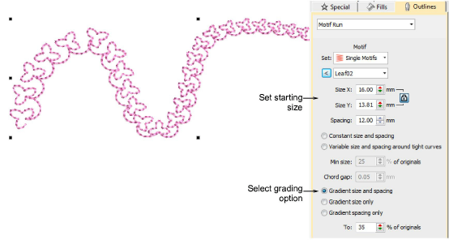
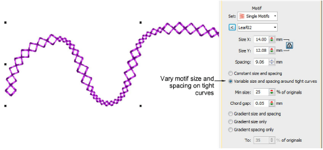

# Create graded motif runs

In some products, size and spacing settings allow you to automatically grade motif size and spacing in motif runs from a specified starting size to finishing size.

Options include:

- Grade motif size proportionally or maintain constant size.
- Grade motif spacing proportionally or maintain constant spacing.
- Vary motif size and spacing on tight curves. This option automatically reduces motif size and spacing in proportion to the sharpness of the curve, similar to variable run stitch length. Also similar, the ‘chord length’ setting controls how closely motifs follow the curve.

