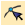
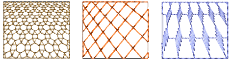
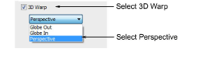
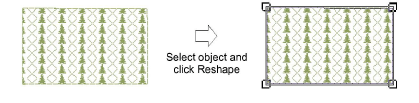
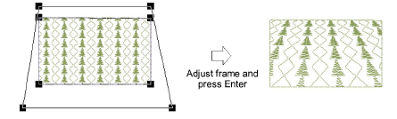

# Create perspective effects

|                | Click Stitch Effects > 3D Warp to apply 3D effects to selected motif fills. Right-click to change settings. |
| -------------------------------------------------------- | ----------------------------------------------------------------------------------------------------------- |
|  | Use Reshape > Reshape Object to reshape selected 3D Warp objects.                                           |

Use Perspective with 3D Warp to create a perspective effect by exaggerating relative sizes.

## To create perspective effects...

- Select a motif fill object and right-click the 3D Warp icon. The Object Properties > Curve docker opens.

- Select the 3D Warp checkbox, and select Perspective from the list.
- Press Enter or click Apply.
- Click the Reshape icon. A guide frame appears around the object.

- Adjust the frame to move the guidelines closer together or further apart.
- Press Enter or click Apply.

Note: The guide frame must not cross the outer boundary of the shape, and cannot be inside the shape.
