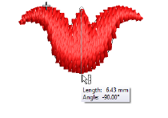
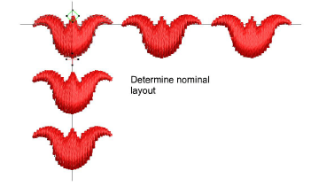
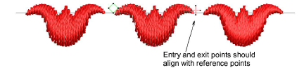
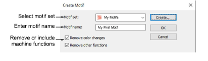
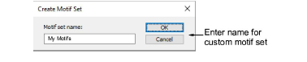
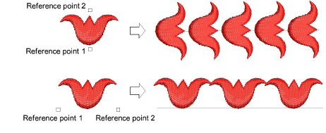
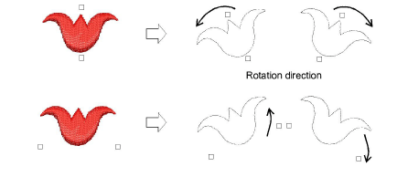
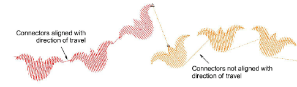

# Create & save motifs

The Create Motif function lets you save your own motifs for future use. Custom motifs are saved in custom ‘motif sets’.

## To create and save a motif...

1. Create or choose the object you want to save as a motif. This may be an outline or a filled object.

2. Adjust stitch angles as required, and turn off any underlays.

3. Scale to a suitable nominal size for practical use – e.g. 5-10 mm. Bear in mind that motif size can be adjusted within the run or fill.

4. Duplicate and align the motif as you want it to appear in a motif run. Use Alignment tools for precise arrangement.

5. Once you have determined the layout, select objects and apply Closest Join. Use the middle motif to determine reference points.

6. Select the motif and choose Object > Create Motif.

7. Select a custom motif set from the droplist and enter a name in the Motif Name field.

- Optionally, click Create. The Create Motif Set dialog opens.

- Enter a name for the new motif set and click OK. The Motif Set is ready for use. Motif sets are stored in the program folder ...\\Userletw.

8. Choose how to handle any included [machine functions](../../glossary/glossary):

- If you have created a multi-color motif, untick the Remove color changes option. This ensures that color changes are preserved.
- If you have created a motif with explicit trims, untick the Remove other functions option. This ensures that trims are preserved.

9. Click OK.

10. Click two reference points for the motif. These should coincide with entry and exit points.

- Reference points determine default motif orientation. They also determine default spacing between motifs.

- With individual motifs, reference point 1 becomes the anchor point. Reference point 2 becomes the rotation point.

11. Click OK. The motif is ready for use. Check to make sure connectors align with the direction of travel.

