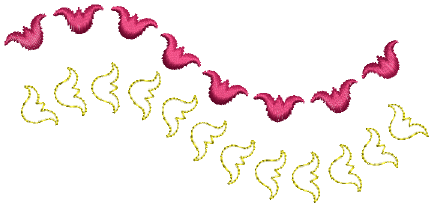

# Custom motifs

EmbroideryStudio provides a function for creating custom motifs for use in motif runs and fills, or as individual motif placements.

::: tip
A motif may include color changes, trims, and even different stitch types. However, remember that whenever used in a motif run or fill, each motif must be stitched individually in sequence. Optionally, they may be broken apart and manually resequenced.
:::

## Related topics...

- [Create & save motifs](Create_save_motifs)
- [Manage custom motifs](Manage_custom_motifs)
