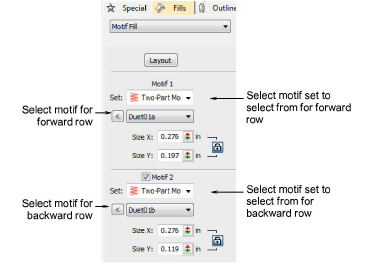
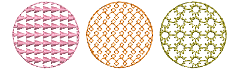
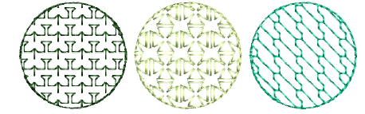
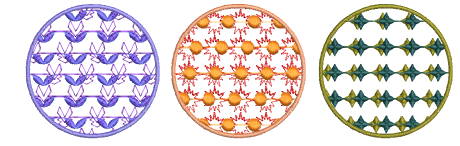

# Digitize motif fills

|  | Use Fill Stitch Types > Motif Fill to create decorative fills using embroidery motifs to form repeating patterns. Right-click for settings. |
| ------------------------------------------------ | ------------------------------------------------------------------------------------------------------------------------------------------- |
|        | Use Traditional Digitizing > Complex Fill to digitize filled shapes with a single stitch angle. Right-click for settings.                   |

Digitize closed objects with Motif Fill or apply it to existing objects. Pretty much any closed digitizing tool can be used, including Freehand Closed Shape. Stitch angles are ignored. Select from a wide range of motifs. Mix and match different motifs for forward and backward rows, or use the same motif for each. There is a special Two-Part Motifs set which contains complementary paired motifs.

## To digitize a motif fill...

- Click Motif Fill and select a closed digitizing tool.
- Double-click the object or right-click the Motif Fill icon to access object properties.

- In the Motif 1 panel, select a motif set and pattern from the library. For single rows, use the Single Motifs set. You can also use monogram ornaments or even define your own sets.

- If you want different motifs for forward and backward rows, select the Motif 2 checkbox. For best results, use the Two-Part Motifs set for both.
- In the Motif 2 panel, select a complementary motif. The predefined two-part motif set is specially designed to provide complementary motifs for forward and backward rows – e.g. ‘Duet01a’ and ‘Duet01b’.

::: tip
As an alternative, you can generate layers of colored motifs by duplicating an object and selecting a different color and/or motif.
:::

## Related topics...

- [Motif scaling](Motif_fill_settings)
